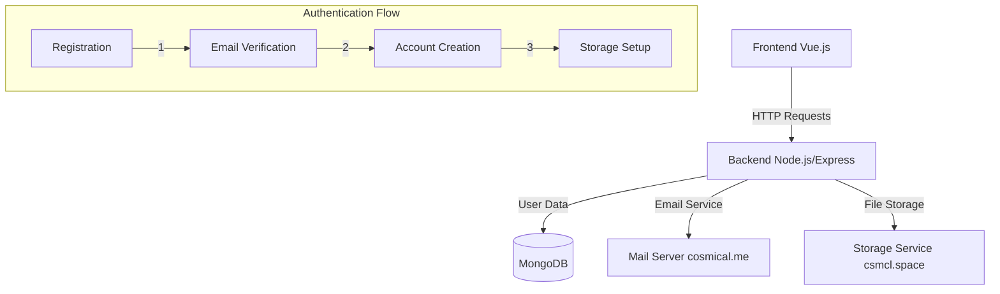

# Authentication System Documentation

## Current Architecture

### System Overview


### Components

#### 1. Frontend (Vue.js + Tailwind CSS)
- Registration form with validation
- Email verification handling
- User dashboard interface
- Modern, responsive design

#### 2. Backend (Node.js + Express)
- User authentication controller
- Email service integration
- Storage service management
- Security middleware

#### 3. Database (MongoDB)
- User schema with validation
- Email verification tokens
- Session management
- Account status tracking

#### 4. Mail Server (cosmical.me)
- Email account creation
- Verification email delivery
- Custom domain email handling

#### 5. Storage Server (csmcl.space)
- User home directory creation
- File storage management
- SSL/TLS security

### Current Features

#### User Registration Flow
1. **Account Creation**
   - Username validation
   - Email validation
   - Password security checks
   - Duplicate account prevention

2. **Email Verification**
   - Secure token generation
   - Time-limited verification
   - Automated email sending
   - Token validation

3. **Resource Setup**
   - Email account creation
   - Storage directory initialization
   - Account activation

4. **Testing Infrastructure**
   - Automated flow testing
   - Local mail server integration
   - MongoDB test integration
   - Error handling validation

## Next Steps

### 1. Security Enhancements
- [ ] Implement rate limiting
- [ ] Add CSRF protection
- [ ] Enable 2FA support
- [ ] Add IP-based blocking

### 2. User Management
- [ ] Password reset flow
- [ ] Account deletion
- [ ] Profile management
- [ ] Session management

### 3. Email System
- [ ] Email templates
- [ ] HTML email styling
- [ ] Bounce handling
- [ ] Spam protection

### 4. Storage System
- [ ] Quota management
- [ ] File sharing
- [ ] Backup system
- [ ] Version control

### 5. Testing
- [ ] Integration tests
- [ ] Load testing
- [ ] Security testing
- [ ] UI/UX testing

### 6. Monitoring
- [ ] Error tracking
- [ ] Performance monitoring
- [ ] User analytics
- [ ] System health checks

## Environment Setup

### Development Environment
```env
NODE_ENV=development
MONGODB_URI=mongodb://localhost:27017/cosmic-nexus
MAIL_API_ENDPOINT=localhost:25
MAIL_DOMAIN=local-dev.test
FRONTEND_URL=http://localhost:3000
```

### Production Environment
```env
NODE_ENV=production
MONGODB_URI=<production-mongodb-uri>
MAIL_API_ENDPOINT=https://mail.cosmical.me/api
MAIL_DOMAIN=cosmical.me
FRONTEND_URL=https://csmcl.space
```

## API Documentation

### Authentication Endpoints

#### POST /api/auth/register
```javascript
{
  "displayName": "string",
  "csmclName": "string",
  "regularEmail": "string",
  "simNumber": "string",
  "password": "string"
}
```

#### POST /api/auth/verify-email
```javascript
{
  "token": "string"
}
```

#### POST /api/auth/login
```javascript
{
  "email": "string",
  "password": "string"
}
```

## Testing

### Running Tests
```bash
# Development tests with local mail server
NODE_ENV=development npm run test:users

# Production tests
NODE_ENV=production npm run test:users
```

### Test Coverage
- [x] User registration
- [x] Email verification
- [x] Token validation
- [x] Error handling

## Deployment

### Server Requirements
- Node.js 18+
- MongoDB 5+
- Ubuntu 22.04 LTS
- SSL/TLS certificates

### Domain Configuration
- csmcl.space: Web server + SSL
- cosmical.me: Mail server + DKIM/SPF/DMARC
