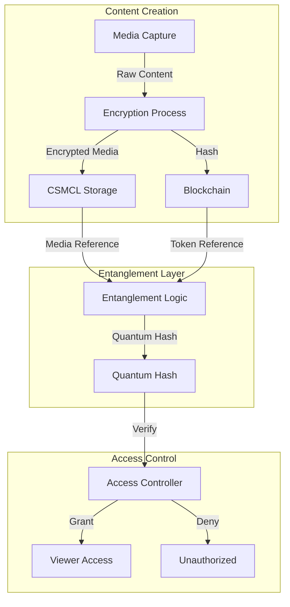
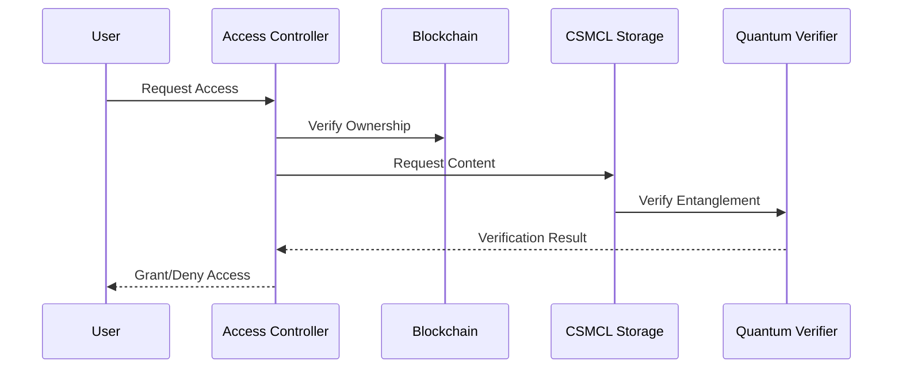

# Encrypted NFT Architecture with Quantum-Inspired Entanglement

## System Overview



## Encryption Architecture

### 1. Media Encryption System
```javascript
interface EncryptedMedia {
  content: {
    data: EncryptedBuffer,
    format: MediaFormat,
    timestamp: DateTime,
    dimensions: Dimensions
  },
  encryption: {
    algorithm: string,
    version: string,
    keyFragments: KeyFragment[],
    nonce: string
  },
  verification: {
    originalHash: string,
    encryptedHash: string,
    proofChain: ProofBlock[]
  }
}
```

### 2. Blockchain Integration
```javascript
interface NFTContract {
  tokenId: string,
  mediaReference: {
    storageId: string,
    encryptionKey: {
      publicPart: string,
      fragmentHashes: string[]
    },
    verificationData: {
      contentHash: string,
      timestampHash: string,
      locationProof: string
    }
  },
  entanglementProof: {
    quantumHash: string,
    stateVector: string[],
    verificationChain: string[]
  }
}
```

## Entanglement Mechanism

### 1. Quantum-Inspired Hash Generation
```javascript
class QuantumHashGenerator {
  generateEntangledHash(
    mediaContent: EncryptedMedia,
    blockchainToken: NFTContract
  ): QuantumHash {
    // Create superposition of content and token hashes
    const contentState = this.hashToQuantumState(mediaContent.verification.encryptedHash);
    const tokenState = this.hashToQuantumState(blockchainToken.mediaReference.contentHash);
    
    // Entangle states
    const entangledState = this.entangleStates(contentState, tokenState);
    
    // Generate verifiable proof
    const proof = this.generateStateProof(entangledState);
    
    return {
      hash: this.stateToHash(entangledState),
      proof: proof,
      verification: this.createVerificationChain(proof)
    };
  }
}
```

### 2. Storage Integration
```javascript
interface EntangledStorage {
  mediaStore: {
    location: string,
    encryption: EncryptionMetadata,
    access: AccessControl,
    replication: ReplicationPolicy
  },
  blockchain: {
    contract: string,
    network: string,
    verification: VerificationProtocol
  },
  entanglement: {
    quantumHash: string,
    proofChain: string[],
    stateVector: number[]
  }
}
```

## Security Features

### 1. Multi-Layer Encryption
```javascript
class SecurityLayer {
  // Content encryption
  encryptContent(content: MediaContent): EncryptedContent {
    const contentKey = this.generateContentKey();
    const encryptedData = this.encryptWithKey(content, contentKey);
    const keyFragments = this.splitKey(contentKey);
    
    return {
      data: encryptedData,
      keyFragments: this.distributeKeyFragments(keyFragments)
    };
  }

  // Verification chain
  createVerificationChain(content: EncryptedContent): VerificationChain {
    const timeStamp = this.secureTimestamp();
    const locationProof = this.generateLocationProof();
    const contentHash = this.hashContent(content);
    
    return this.chainProofs([timeStamp, locationProof, contentHash]);
  }
}
```

### 2. Access Control
```javascript
class AccessController {
  async verifyAccess(
    request: AccessRequest,
    entanglement: EntangledStorage
  ): Promise<AccessGrant> {
    // Verify blockchain ownership
    const ownershipProof = await this.verifyOwnership(
      request.userId,
      entanglement.blockchain
    );

    // Verify content integrity
    const contentIntegrity = await this.verifyContentIntegrity(
      entanglement.mediaStore,
      entanglement.entanglement
    );

    // Generate access token
    return this.generateAccessToken(
      ownershipProof,
      contentIntegrity,
      request.scope
    );
  }
}
```

## Implementation Strategy

### 1. Storage Layer (csmcl.space)
```javascript
class CSMCLStorage {
  // Encrypted content storage
  async storeEncryptedContent(
    content: EncryptedMedia,
    entanglement: EntanglementProof
  ): Promise<StorageReference> {
    const storageLocation = await this.allocateSecureStorage();
    const contentStore = await this.writeEncrypted(content);
    const entanglementStore = await this.storeEntanglement(entanglement);
    
    return {
      contentId: contentStore.id,
      entanglementId: entanglementStore.id,
      accessPath: this.generateSecurePath(contentStore, entanglementStore)
    };
  }
}
```

### 2. Blockchain Layer
```javascript
class BlockchainController {
  // NFT creation with entanglement
  async createEntangledNFT(
    mediaReference: StorageReference,
    entanglement: EntanglementProof
  ): Promise<NFTContract> {
    const contract = await this.deploySmartContract();
    const token = await this.mintToken(contract);
    
    await this.setEntanglementProof(token, entanglement);
    await this.linkMediaReference(token, mediaReference);
    
    return {
      tokenId: token.id,
      contract: contract.address,
      entanglement: entanglement.proof
    };
  }
}
```

## Verification Process



## Next Steps

### 1. Core Implementation
- [ ] Encryption system
- [ ] Quantum hash generator
- [ ] Storage integration
- [ ] Blockchain contracts

### 2. Security Features
- [ ] Multi-layer encryption
- [ ] Access control system
- [ ] Verification chains
- [ ] Integrity checks

### 3. User Interface
- [ ] Content viewer
- [ ] Ownership management
- [ ] Access controls
- [ ] Transaction history

This architecture ensures that NFTs and their associated media are cryptographically bound together, making them tamper-proof and creating a verifiable chain of ownership and authenticity.
