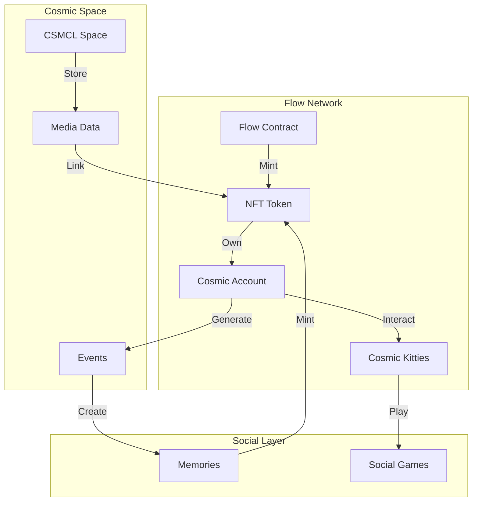

# Flow Blockchain Integration for Cosmic NFTs

## Overview



## Flow Smart Contract

### 1. Cosmic NFT Contract
```cadence
pub contract CosmicNFT {
    // NFT resource
    pub resource NFT {
        pub let id: UInt64
        pub let metadata: {String: String}
        
        // Cosmic-specific properties
        pub let mediaHash: String
        pub let entanglementProof: String
        pub let interactionHistory: [InteractionEvent]
        
        init(
            id: UInt64,
            metadata: {String: String},
            mediaHash: String,
            entanglementProof: String
        ) {
            self.id = id
            self.metadata = metadata
            self.mediaHash = mediaHash
            self.entanglementProof = entanglementProof
            self.interactionHistory = []
        }
    }

    // Collection resource
    pub resource Collection {
        pub var ownedNFTs: @{UInt64: NFT}
        
        // Add NFT to collection
        pub fun deposit(token: @NFT) {
            self.ownedNFTs[token.id] <-! token
        }
        
        // Remove NFT from collection
        pub fun withdraw(id: UInt64): @NFT {
            let token <- self.ownedNFTs.remove(key: id)
                ?? panic("NFT not found")
            return <-token
        }
    }
}
```

### 2. Cosmic Kitties Integration
```cadence
pub contract CosmicKitties {
    pub resource Kitty {
        pub let id: UInt64
        pub var genes: [UInt8]
        pub var interactionCount: UInt64
        pub var lastInteraction: UFix64
        
        // Kitty properties
        pub var energy: UFix64
        pub var happiness: UFix64
        pub var experience: UFix64
        
        // Interaction with other kitties
        pub fun interact(other: &Kitty) {
            pre {
                self.energy >= 10.0
                other.energy >= 10.0
            }
            
            // Generate interaction event
            self.interactionCount = self.interactionCount + 1
            self.lastInteraction = getCurrentBlock().timestamp
            
            // Update stats
            self.energy = self.energy - 10.0
            self.happiness = self.happiness + 5.0
            self.experience = self.experience + 1.0
        }
        
        // Generate NFT from memorable interaction
        pub fun createMemoryNFT(): @CosmicNFT.NFT {
            pre {
                self.experience >= 100.0
            }
            
            // Create memory metadata
            let metadata: {String: String} = {
                "type": "KittyMemory",
                "experience": self.experience.toString(),
                "timestamp": self.lastInteraction.toString()
            }
            
            // Mint new NFT
            return <-create CosmicNFT.NFT(
                id: self.interactionCount,
                metadata: metadata,
                mediaHash: self.generateMediaHash(),
                entanglementProof: self.generateProof()
            )
        }
    }
}
```

## Integration Features

### 1. Kitty Interactions
```typescript
interface KittyInteraction {
    type: 'play' | 'groom' | 'adventure' | 'rest',
    participants: {
        kittyId: string,
        ownerAddress: string
    }[],
    location: {
        virtual: boolean,
        coordinates?: string,
        venue?: string
    },
    outcome: {
        experienceGained: number,
        memorabilityScore: number,
        nftCreated: boolean
    }
}
```

### 2. Memory Generation
```typescript
interface KittyMemory {
    moment: {
        timestamp: number,
        type: string,
        description: string,
        participants: string[]
    },
    media: {
        images: string[],
        animation?: string,
        sound?: string
    },
    stats: {
        rarity: number,
        memorabilityScore: number,
        socialImpact: number
    }
}
```

## Implementation Strategy

### 1. Flow Account Setup
```javascript
class FlowAccountManager {
    async setupUserAccount(user) {
        // Create Flow account
        const flowAccount = await this.createFlowAccount();
        
        // Setup NFT Collection
        await this.setupNFTCollection(flowAccount);
        
        // Setup Kitty Collection
        await this.setupKittyCollection(flowAccount);
        
        return {
            address: flowAccount.address,
            collections: {
                nft: flowAccount.collections.nft,
                kitties: flowAccount.collections.kitties
            }
        };
    }
}
```

### 2. Kitty Generation
```javascript
class KittyGenerator {
    generateKitty(ownerAddress) {
        const genes = this.generateRandomGenes();
        const personality = this.determinePersonality(genes);
        
        return {
            genes,
            personality,
            stats: {
                energy: 100,
                happiness: 100,
                experience: 0
            },
            metadata: {
                birthday: Date.now(),
                generation: this.calculateGeneration(),
                traits: this.determineTraits(genes)
            }
        };
    }
}
```

## Social Features

### 1. Kitty Playgrounds
```typescript
interface KittyPlayground {
    location: string,
    activeKitties: KittyPresence[],
    activities: Activity[],
    rewards: {
        experience: number,
        items: Item[],
        nftChance: number
    }
}
```

### 2. Social Events
```typescript
interface KittySocialEvent {
    type: 'party' | 'race' | 'show' | 'adventure',
    requirements: {
        minLevel: number,
        traits: string[],
        energy: number
    },
    rewards: {
        experience: number,
        items: Item[],
        nftGeneration: boolean
    }
}
```

## Next Steps

### 1. Flow Integration
- [ ] Setup Flow testnet environment
- [ ] Deploy smart contracts
- [ ] Implement account management
- [ ] Test NFT minting

### 2. Kitty System
- [ ] Implement kitty generation
- [ ] Create interaction mechanics
- [ ] Design evolution system
- [ ] Build social features

### 3. Memory System
- [ ] Design memory generation
- [ ] Implement NFT creation
- [ ] Create visualization system
- [ ] Build sharing mechanics

This integration combines the fun of virtual pets with the permanence of blockchain memories, creating a unique social experience in the Cosmic space.
