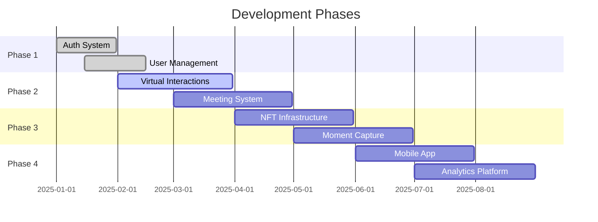
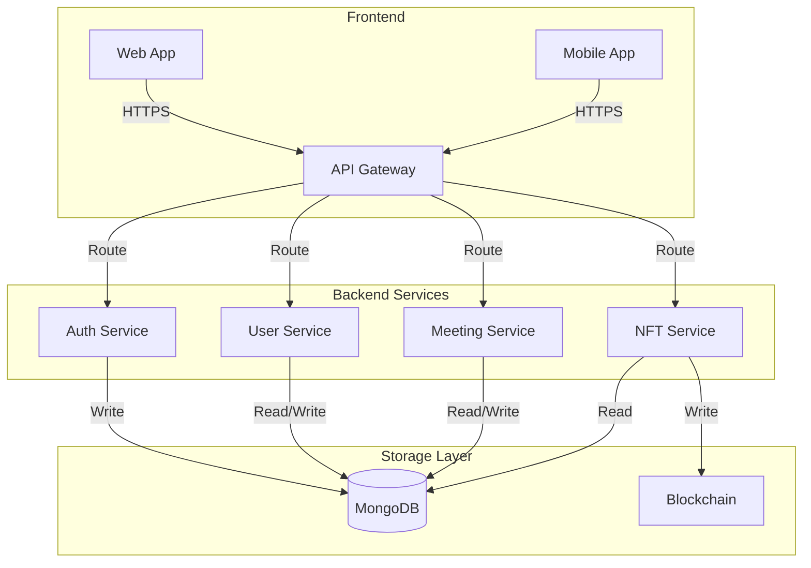

# Cosmic Nexus: Future Roadmap 2025-2026

## Vision
Create a hybrid social platform that seamlessly blends virtual and physical interactions, authenticated by blockchain technology and enriched with digital memorabilia.

## Phase 1: Foundation (Completed)
✅ **Authentication System**
- User registration and verification
- Email integration with cosmical.me
- Storage system on csmcl.space
- Security infrastructure

## Phase 2: Virtual Interaction Layer (Q1 2025)
### 1. User Interaction System
- [ ] Interest-based matching algorithm
- [ ] Multi-dimensional user space
- [ ] Dynamic behavior patterns
- [ ] Group formation mechanics

### 2. Meeting Coordination
- [ ] Smart location suggestions
- [ ] Schedule optimization
- [ ] Activity recommendations
- [ ] Group size balancing

## Phase 3: Physical Integration (Q2 2025)
### 1. Real-World Interface
- [ ] Location verification
- [ ] Presence validation
- [ ] Moment detection
- [ ] Media capture system

### 2. NFT Infrastructure
- [ ] Smart contract development
- [ ] Media processing pipeline
- [ ] Ownership management
- [ ] Royalty distribution

## Phase 4: Platform Enhancement (Q3 2025)
### 1. Mobile Experience
- [ ] iOS/Android apps
- [ ] Real-time notifications
- [ ] Location services
- [ ] Media capture tools

### 2. Analytics & Insights
- [ ] Interaction metrics
- [ ] Network analysis
- [ ] Trend detection
- [ ] Recommendation engine

## Phase 5: Ecosystem Growth (Q4 2025)
### 1. Marketplace Development
- [ ] NFT trading platform
- [ ] Value exchange system
- [ ] Collection management
- [ ] Auction mechanics

### 2. Community Features
- [ ] Event organization
- [ ] Group collections
- [ ] Shared experiences
- [ ] Memory chains

## Technical Infrastructure

### Server Architecture

### Domain Integration
- **csmcl.space**
  - Web application hosting
  - Media storage
  - NFT metadata
  - User profiles

- **cosmical.me**
  - Email notifications
  - Verification services
  - System alerts
  - User communications

## Success Metrics

### 1. Engagement
- Active user growth
- Meeting frequency
- NFT creation rate
- User retention

### 2. Network Effects
- Connection density
- Group formation
- Activity clusters
- Viral coefficient

### 3. Value Creation
- NFT trading volume
- Collection value
- Platform activity
- Community growth

## Risk Management

### 1. Technical Risks
- Blockchain scalability
- Media storage costs
- Network performance
- Security threats

### 2. User Adoption
- Value proposition
- Learning curve
- Trust building
- Privacy concerns

### 3. Market Risks
- Competition
- Regulation
- Technology changes
- Market conditions

## Resource Requirements

### 1. Development Team
- Frontend developers
- Backend engineers
- Blockchain specialists
- UX/UI designers

### 2. Infrastructure
- Cloud services
- Blockchain nodes
- Storage systems
- CDN network

### 3. Operations
- Community management
- Support team
- Security monitoring
- Content moderation

## Next Immediate Steps

1. **Complete Phase 2 Planning**
   - Finalize interaction algorithms
   - Design meeting system
   - Plan infrastructure scaling
   - Develop testing framework

2. **Begin NFT Infrastructure**
   - Select blockchain platform
   - Design smart contracts
   - Plan storage architecture
   - Create minting process

3. **Start Mobile Development**
   - Design UI/UX
   - Plan feature set
   - Create prototypes
   - Begin development

This roadmap provides a structured approach to building a comprehensive platform that bridges virtual and physical social interactions while creating lasting digital memories through NFTs.
