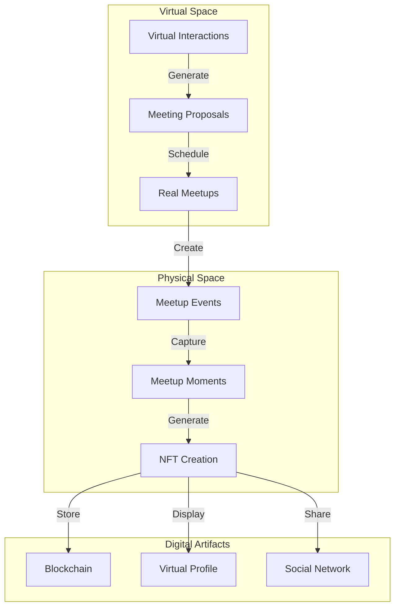
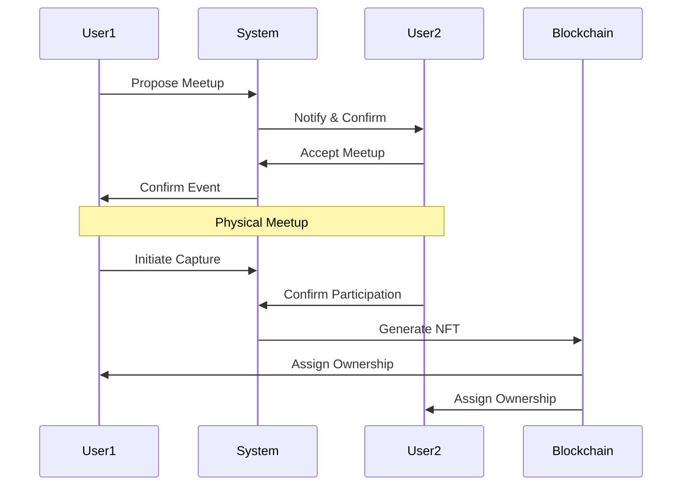

# Hybrid Interaction System with NFT Memorabilia

## System Overview



## Key Components

### 1. Meetup Organization
```javascript
interface MeetupEvent {
  participants: User[]
  location: GeoLocation
  timestamp: DateTime
  interestTags: string[]
  activityType: ActivityType
  virtualContext: InteractionHistory
}
```

### 2. Moment Capture System
```javascript
interface MomentCapture {
  event: MeetupEvent
  media: {
    images: Image[]
    videos: Video[]
    audio: AudioClip[]
  }
  participants: {
    signatures: DigitalSignature[]
    testimonials: string[]
  }
  context: {
    location: GeoLocation
    weather: WeatherData
    ambiance: AmbianceMetrics
  }
}
```

### 3. NFT Generation
```javascript
interface MeetupNFT {
  eventData: MeetupEvent
  mediaAssets: MediaAsset[]
  participantSignatures: DigitalSignature[]
  metadata: {
    timestamp: DateTime
    location: GeoLocation
    participants: string[]
    interactionMetrics: InteractionData
    memorabiliaType: MemorabiliaType
  }
  smartContract: {
    ownership: OwnershipRights[]
    sharing: SharingRules
    royalties: RoyaltyStructure
  }
}
```

## Features

### 1. Smart Meetup Planning
- **Interest-Based Matching**
  - Common topic clustering
  - Activity preference alignment
  - Schedule compatibility
  - Location proximity

- **Context Enhancement**
  - Weather consideration
  - Venue suggestions
  - Activity recommendations
  - Group size optimization

### 2. Real-World Interaction
- **Moment Recognition**
  ```javascript
  class MomentDetector {
    detectSignificantMoments(eventStream: EventStream): Moment[]
    calculateMomentSignificance(moment: Moment): number
    suggestCaptureOpportunity(moment: Moment): CaptureGuide
  }
  ```

- **Participation Validation**
  ```javascript
  class ParticipationVerifier {
    validatePresence(user: User, event: Event): boolean
    collectSignatures(participants: User[]): DigitalSignature[]
    verifyInteraction(user1: User, user2: User): InteractionProof
  }
  ```

### 3. NFT Creation
- **Asset Generation**
  ```javascript
  class NFTGenerator {
    createMomentNFT(
      moment: Moment,
      participants: User[],
      media: MediaAssets
    ): NFT

    assignOwnership(
      nft: NFT,
      participants: User[]
    ): OwnershipContract

    defineRoyalties(
      nft: NFT,
      contributors: Contributor[]
    ): RoyaltyStructure
  }
  ```

- **Metadata Enrichment**
  ```javascript
  interface NFTMetadata {
    event: {
      type: string
      date: DateTime
      location: GeoLocation
      context: string
    }
    participants: {
      profiles: UserProfile[]
      contributions: Contribution[]
      signatures: DigitalSignature[]
    }
    media: {
      primary: MediaAsset
      secondary: MediaAsset[]
      thumbnails: Thumbnail[]
    }
    interaction: {
      type: InteractionType
      significance: number
      tags: string[]
      narrative: string
    }
  }
  ```

### 4. Social Integration
- **Sharing Mechanics**
  - Cross-platform distribution
  - Privacy-aware sharing
  - Interaction tracking
  - Engagement metrics

- **Community Building**
  - Group collections
  - Shared experiences
  - Collaborative storytelling
  - Memory chains

## Implementation Strategy

### 1. Physical Meetup Flow


### 2. NFT Structure
```javascript
class MeetupNFT {
  // Core NFT data
  id: string
  blockchain: string
  contract: string
  
  // Meetup specifics
  event: MeetupEvent
  participants: Participant[]
  location: Location
  timestamp: DateTime
  
  // Media content
  primaryMedia: MediaAsset
  supplementaryMedia: MediaAsset[]
  
  // Metadata
  tags: string[]
  description: string
  significance: number
  
  // Rights management
  owners: Owner[]
  royalties: RoyaltyStructure
  permissions: Permissions
}
```

## Technical Integration

### 1. Blockchain Integration
- Smart contract deployment on csmcl.space
- NFT minting and distribution
- Ownership management
- Royalty distribution

### 2. Storage System
- Media assets on csmcl.space
- Metadata in MongoDB
- Blockchain references
- Access control

### 3. Email Notifications
- Meeting proposals via cosmical.me
- Confirmation requests
- NFT creation alerts
- Sharing notifications

## Next Steps

### 1. Core Development
- [ ] Meetup planning system
- [ ] Moment capture framework
- [ ] NFT generation pipeline
- [ ] Social sharing platform

### 2. Smart Contracts
- [ ] NFT contract development
- [ ] Ownership management
- [ ] Royalty distribution
- [ ] Access control

### 3. User Experience
- [ ] Mobile app development
- [ ] Web interface
- [ ] Notification system
- [ ] Analytics dashboard

This hybrid system creates a seamless bridge between virtual and physical interactions, with NFTs serving as permanent, valuable memorabilia of real-world connections.
