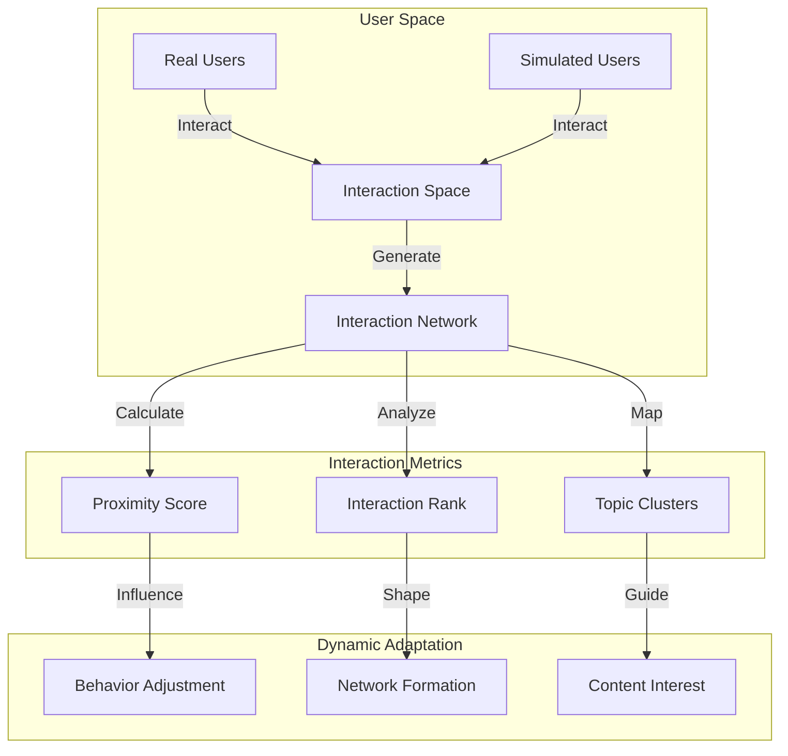
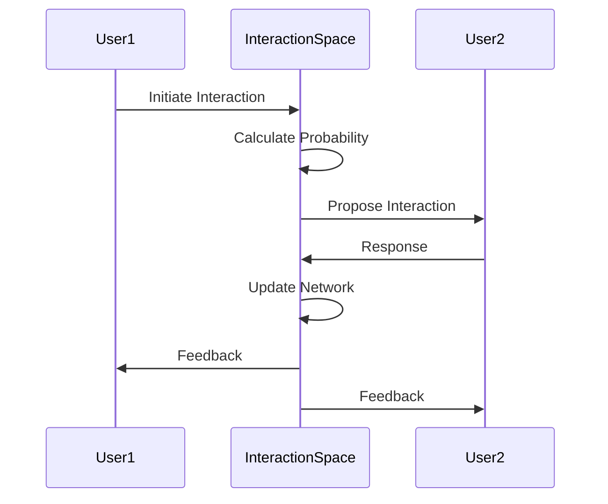

# User Interaction Simulation System

## Concept Overview



## System Components

### 1. User Generation System
- **Profile Generator**
  - Personality traits generation
  - Interest vector creation
  - Behavioral pattern simulation
  - Activity schedule generation

### 2. Interaction Space
- **Coordinate System**
  ```javascript
  class InteractionSpace {
    dimensions: {
      interests: Vector,    // Interest similarity
      activity: Vector,     // Activity patterns
      influence: Vector,    // Social influence
      proximity: Vector     // Network proximity
    }
  }
  ```

### 3. Interaction Types
- Direct messaging
- Content sharing
- Collaborative activities
- Group formations
- Resource exchanges

### 4. Behavioral Patterns
```javascript
type Behavior = {
  basePersonality: PersonalityVector,
  contextualResponses: Map<Context, Response>,
  adaptationRate: number,
  interactionThreshold: number
}
```

## Implementation Strategy

### 1. User Simulation
```javascript
class SimulatedUser {
  // Core attributes
  profile: UserProfile
  behavior: Behavior
  interactionHistory: InteractionLog[]
  
  // Dynamic properties
  coordinates: Vector
  connections: Map<UserId, ConnectionStrength>
  interests: InterestVector
  
  // Methods
  calculateNextAction()
  respondToInteraction(interaction: Interaction)
  updatePosition(context: Context)
  adaptBehavior(feedback: Feedback)
}
```

### 2. Interaction Mechanics
```javascript
class InteractionEngine {
  // Spatial organization
  userSpace: Map<Vector, User[]>
  interactionProbabilities: Matrix
  
  // Event handling
  scheduleInteractions()
  processInteraction(source: User, target: User)
  updateNetworkDynamics()
}
```

### 3. Network Evolution


## Simulation Parameters

### 1. User Properties
- Personality traits (Big Five model)
- Interest vectors (topic-based)
- Activity patterns
- Network position
- Influence score

### 2. Interaction Rules
- Proximity threshold
- Interest overlap requirement
- Time-based availability
- Response probability
- Adaptation rate

### 3. Network Dynamics
- Connection strength decay
- Interest drift
- Influence propagation
- Group formation rules

## Example Scenarios

### 1. Interest-Based Clustering
```javascript
// Example of interest-based user matching
function matchUsers(user1, user2) {
  const interestOverlap = calculateOverlap(user1.interests, user2.interests);
  const proximityScore = calculateProximity(user1.coordinates, user2.coordinates);
  const timeCompatibility = checkTimeCompatibility(user1.schedule, user2.schedule);
  
  return {
    matchScore: combineScores(interestOverlap, proximityScore, timeCompatibility),
    interactionProbability: calculateProbability(matchScore)
  };
}
```

### 2. Dynamic Group Formation
```javascript
// Example of group dynamics
class Group {
  members: Set<User>
  commonInterests: InterestVector
  activityLevel: number
  cohesion: number
  
  evaluateMembership(user: User): boolean
  updateGroupDynamics(): void
  planGroupActivities(): Activity[]
}
```

## Integration with Real Users

### 1. Interaction Bridging
- Real user preference learning
- Simulated user adaptation
- Interaction history tracking
- Feedback incorporation

### 2. Content Generation
- Topic-based discussions
- Activity suggestions
- Resource sharing
- Collaborative projects

### 3. Network Growth
- Organic connection formation
- Interest-based recommendations
- Activity-driven clustering
- Dynamic reorganization

## Next Steps

### 1. Core Implementation
- [ ] User generation system
- [ ] Interaction space framework
- [ ] Behavior simulation engine
- [ ] Network dynamics processor

### 2. Testing & Validation
- [ ] User behavior patterns
- [ ] Interaction authenticity
- [ ] Network formation patterns
- [ ] System scalability

### 3. Integration Features
- [ ] Real user interfacing
- [ ] Content recommendation
- [ ] Activity scheduling
- [ ] Feedback processing

## Technical Requirements

### 1. Performance
- Real-time interaction processing
- Efficient spatial calculations
- Scalable user simulation
- Optimized network updates

### 2. Storage
- User state management
- Interaction history
- Network topology
- Behavioral patterns

### 3. Processing
- Vector calculations
- Probability computations
- Pattern recognition
- Network analysis

This system would create a rich, dynamic environment where simulated users can interact meaningfully with real users, creating organic network growth and authentic interaction patterns.
