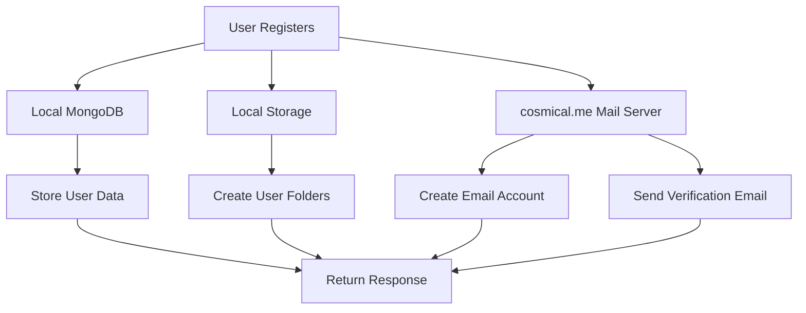

# Registration Flow

## Local Development Flow



### Step-by-Step Process

1. **User Registration Request**
   - Frontend: `http://localhost:3000`
   - API: `http://localhost:5000/api/auth/register`

2. **Local Database (MongoDB)**
   ```javascript
   // Stored in localhost:27017/cosmic-nexus-dev
   {
     displayName: "Test User",
     csmclName: "testuser",
     regularEmail: "external@example.com",
     cosmicalEmail: "testuser@cosmical.me"  // Their cosmical.me email
   }
   ```

3. **Local Storage**
   ```
   /home/nsbasicus/CascadeProjects/StarterTemplateDesignIdeas/storage/dev/
   └── users/
       └── testuser/
           ├── public/
           └── private/
   ```

4. **Mail Server Actions (on cosmical.me)**
   - Create email account: `testuser@cosmical.me`
   - Set up email forwarding to: `external@example.com`
   - Send verification email from: `noreply@cosmical.me`

### Important Notes

1. **Mixed Environment**
   - Database: Local
   - Storage: Local
   - Email: Production (cosmical.me)

2. **Email Dependencies**
   - All email accounts must be created on cosmical.me
   - No local email server setup possible
   - Verification emails always sent through cosmical.me

3. **Testing Considerations**
   - Local data can be freely modified/deleted
   - Email accounts on cosmical.me need careful management
   - Consider using test- prefix for development accounts

4. **Security**
   - Keep production mail server credentials secure
   - Use environment variables for sensitive data
   - Implement proper error handling for mail server operations
